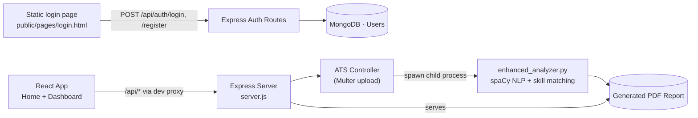

<div align="center">

# ApplyXpert

**NLP-powered ATS resume analyzer and job application tracker.** Upload a resume and a job description, get a weighted match score, missing-keyword suggestions, and a downloadable PDF report.

[](https://nodejs.org/)
[](https://react.dev/)
[](https://www.python.org/)
[](https://www.mongodb.com/)
[](LICENSE)
[](#)

[Features](#features) · [Architecture](#architecture) · [Quick Start](#quick-start) · [Contributing](#contribution)

</div>

---

<details>
<summary><strong>Table of Contents</strong></summary>

1. [Introduction](#introduction)
2. [Demo](#demo)
3. [Features](#features)
4. [Architecture](#architecture)
5. [Working](#working)
6. [Tech Stack](#tech-stack)
7. [Project Structure](#project-structure)
8. [Quick Start](#quick-start)
9. [Contribution](#contribution)
10. [Contact](#contact)
11. [License](#license)

</details>

---

## Introduction

ApplyXpert helps job seekers understand how well their resume matches a specific job description. A user uploads one or more resumes (PDF/DOC/DOCX) and pastes a job description; a Python NLP engine compares them using semantic similarity and categorized skill-keyword matching, then returns a weighted ATS score, a list of missing skills, and a downloadable PDF report with improvement suggestions.

The **resume-analysis pipeline is fully implemented end-to-end** (upload → Node.js orchestration → Python/spaCy analysis → PDF report). The dashboard also includes **Auto Apply Job** and **Applied Jobs History** sections; these currently exist as frontend UI scaffolding (static forms / mock data) and are not yet wired to a backend — genuinely a work in progress, as flagged in the project's commit history.

## Demo

> Add a screenshot or short recording of the Home page, the ATS Score upload/results flow, and a sample PDF report here.

<div align="center">

| Home | ATS Score | PDF Report |
|:---:|:---:|:---:|
|  |  |  |

</div>

## Features

- **Multi-resume ATS scoring** — Upload up to 10 resumes at once and score each against the same job description.
- **Hybrid scoring model** — Combines spaCy semantic similarity with categorized keyword matching across programming languages, frontend, backend, database, DevOps, tools, and soft-skill concepts.
- **Missing-keyword detection** — Surfaces the specific skills/keywords present in the job description but absent from the resume.
- **Downloadable PDF reports** — Generates a detailed, per-resume report (score breakdown, missing skills, suggestions) via FPDF.
- **JWT authentication** — Register/login with bcrypt-hashed passwords and token-based session verification.
- **Dashboard shell** — Profile, ATS Score, Applied Jobs, and Auto Apply sections, gated behind login.
- **Auto Apply Job & Applied Jobs History (UI scaffolding)** — Forms and tables are built; backend integration and persistence are not yet implemented.

## Architecture

The system spans three parts: a static authentication page, a React dashboard, and an Express API that delegates resume analysis to a Python NLP script via a child process.



| Component | Responsibility |
|---|---|
| `frontend/public/pages/login.html` | Standalone login/register page; stores the JWT in `localStorage` on success |
| `frontend/src` | React app — public Home page plus a token-gated Dashboard (Profile, ATS Score, Applied Jobs, Auto Apply) |
| `backend/routes`, `backend/controllers` | Express REST API — auth, file upload handling, and Python process orchestration |
| `ml-models/resume_matcher` | Python NLP engine — text extraction, scoring, keyword matching, PDF report generation |

> Note: `resume_analyzer.py` is an earlier version of the analyzer kept in the repo; all current endpoints call `enhanced_analyzer.py`.

## Working

1. **Authenticate** — A user registers or logs in via the static login page, which calls the Express auth API directly and stores the returned JWT in the browser.
2. **Access the dashboard** — The React app checks for that token before rendering the Profile, ATS Score, Applied Jobs, and Auto Apply routes.
3. **Upload & describe** — On the ATS Score page, the user uploads one or more resumes and pastes the target job description.
4. **Orchestrate** — The request hits an `/api/ats/*` endpoint; Express stores the file with Multer and spawns `enhanced_analyzer.py` as a child process, passing the file path and job description.
5. **Analyze** — The Python script extracts resume text (PyMuPDF), computes a spaCy semantic-similarity score, matches categorized skill keywords, and combines both into a weighted match score with section-level detail.
6. **Report** — The script writes a PDF report to disk and returns the score, missing keywords, and suggestions as JSON; Express forwards the JSON to the frontend and serves the PDF from `backend/reports` or `ml-models/resume_matcher/reports` on request.

## Tech Stack

<table>
<tr>
<td><strong>Frontend</strong></td>
<td>


</td>
</tr>
<tr>
<td><strong>Backend</strong></td>
<td>


</td>
</tr>
<tr>
<td><strong>Database</strong></td>
<td>

</td>
</tr>
<tr>
<td><strong>NLP / ML</strong></td>
<td>


</td>
</tr>
</table>

## Project Structure

```
ApplyXpert/
├── backend/                 # Node.js + Express API — auth, file uploads, ATS orchestration
├── frontend/                # React single-page app — landing page, dashboard, ATS UI
├── ml-models/
│   └── resume_matcher/            # Python NLP engine — resume parsing, scoring, PDF reports
├── LICENSE
└── README.md
```

## Quick Start

### Prerequisites

- [Node.js](https://nodejs.org/) v14+
- [Python](https://www.python.org/) 3.8+ with pip
- [MongoDB](https://www.mongodb.com/cloud/atlas) (local instance or Atlas)
- [Git](https://git-scm.com/)

> **Before you start:** `backend/` and `frontend/` currently include only `package-lock.json`, not `package.json`. If `npm install` fails with a missing-manifest error, generate a minimal `package.json` in each folder (`npm init -y`) so npm has something to install against — the lockfile will still resolve the correct dependency versions.

### Environment

Create a `.env` file inside `backend/`:

```env
PORT=5001
JWT_SECRET=your_jwt_secret_key
MONGODB_URI=mongodb://localhost:27017/ApplyXpert
```

`PORT` and `JWT_SECRET` are read from this file. Note that the current MongoDB connection in `server.js` is hardcoded to `mongodb://localhost:27017/ApplyXpert` rather than reading `MONGODB_URI` — update that connection string directly in `server.js` if you need to point at a remote/Atlas cluster.

### Installation

```bash
git clone https://github.com/DevSharma03/ApplyXpert.git
cd ApplyXpert

# Backend
cd backend
npm install
cd ..

# Frontend
cd frontend
npm install
cd ..

# NLP engine
cd ml-models/resume_matcher
pip install -r requirements.txt
python -m spacy download en_core_web_sm
cd ../..
```

### Running

```bash
# Terminal 1 — backend (from backend/)
npm start
# → http://localhost:5001

# Terminal 2 — frontend (from frontend/)
npm start
# → http://localhost:3000  (dev server proxies /api to the backend)
```

Open `http://localhost:3000`, register or log in, and use the **ATS Score** page from the dashboard to analyze a resume.

## Contribution

Contributions are welcome — particularly around the parts still in progress:

- Wiring **Auto Apply Job** to a real backend route and job-platform integration
- Persisting **Applied Jobs History** to MongoDB instead of in-memory mock data
- Adding `package.json` files for backend/frontend to make setup reproducible

To contribute:

1. Fork the repository and create a feature branch:
   ```bash
   git checkout -b feature/your-feature-name
   ```
2. Make your changes, keeping new endpoints consistent with the existing `routes/` → `controllers/` pattern.
3. Commit using a clear, descriptive message:
   ```bash
   git commit -m "feat: add your feature"
   ```
4. Push your branch and open a pull request against `main`, describing the change and its motivation.

Please open an [issue](https://github.com/DevSharma03/ApplyXpert/issues) for bugs or feature requests before submitting large changes.

## Contact

<div align="center">

[](https://github.com/DevSharma03)
[](https://linkedin.com/in/devsharma09)
[](https://dev-portfolio-lyart-six.vercel.app/)
[](mailto:work.devashishsharma09@gmail.com)

</div>

| Channel | Link |
|---|---|
| Issues | [Report a bug](https://github.com/DevSharma03/ApplyXpert/issues) |

## License

This project is licensed under the [MIT License](LICENSE).

<div align="center">

Built by [Devashish Sharma](https://github.com/DevSharma03)

</div>

For support or questions, please contact [work.devashishsharma09@gmail.com](mailto:work.devashishsharma09@gmail.com)
